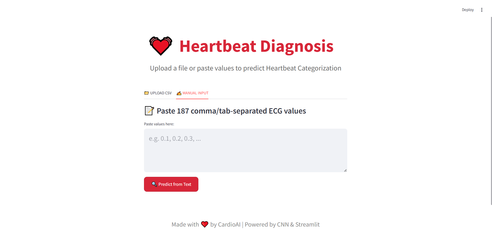
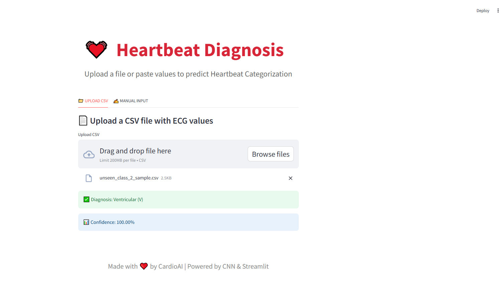

# ECG Heartbeat Classification Web App 

This project is a web-based diagnostic tool that uses a Convolutional Neural Network (CNN) to classify ECG signals into five heartbeat categories:
- Normal (N)
- Supraventricular (S)
- Ventricular (V)
- Fusion (F)
- Unknown (Q)

## 🔬 Model Overview
- Model: 1D CNN built with TensorFlow/Keras
- Input shape: (187, 1)
- Output: 5-class softmax classification
- Accuracy: 98%
- AUC-ROC: 0.9858

## 🧪 Dataset
- Each sample has 187 ECG signal values
- Preprocessing: Normalization, Reshaping, One-hot encoding
- Balanced using SMOTE

## 🛠️ Tech Stack
- **Language:** Python  
- **Libraries:** NumPy, Pandas, Scikit-learn, TensorFlow, Keras  
- **Web Framework:** Streamlit  
- **Deployment:** Local `.h5` model

## 🚀 Run the App Locally
```bash
# Install dependencies
pip install streamlit tensorflow pandas numpy scikit-learn

# Run the app
streamlit run app.py
```
## 🖼️ App Features

- Upload ECG signals via **CSV** file or manual input  
- Real-time heartbeat classification with **confidence scores**  
- Clean, animated **user interface** built with Streamlit  
- Input validation and **error handling** for user-friendly experience  
---

## 📊 Evaluation

- **Model Accuracy:** 98%  
- **ROC-AUC Score:** 0.9858  
- **Evaluation Tools:** Confusion Matrix and Classification Report  

---

## 📸 Screenshots

### 🔍 Input View  


### 🖥️ Input View  


### 🖥️ Prediction View


## 📁 Files

- `app.py` → Streamlit web application code  
- `CNN_model.h5` → Trained 1D CNN model file  
- `README.md` → Project documentation (you’re reading it!)

## ✍️ Author

**Hana Elfar**  
[LinkedIn Profile](https://www.linkedin.com/in/hana-elfar-7b017a229/)

